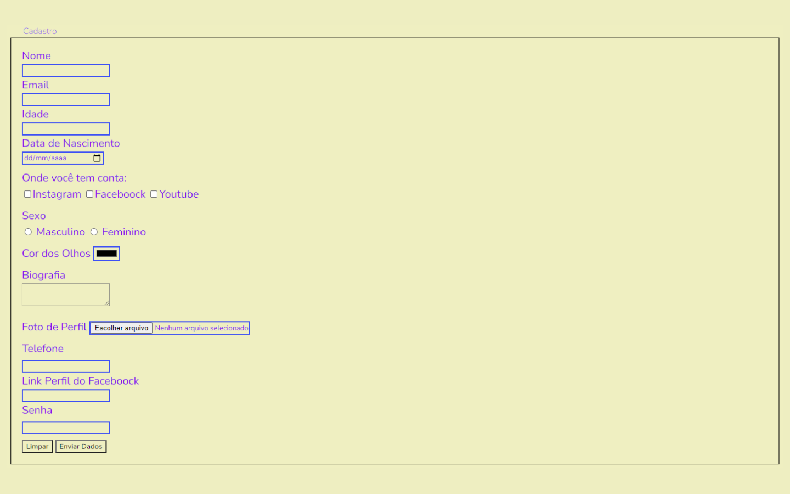
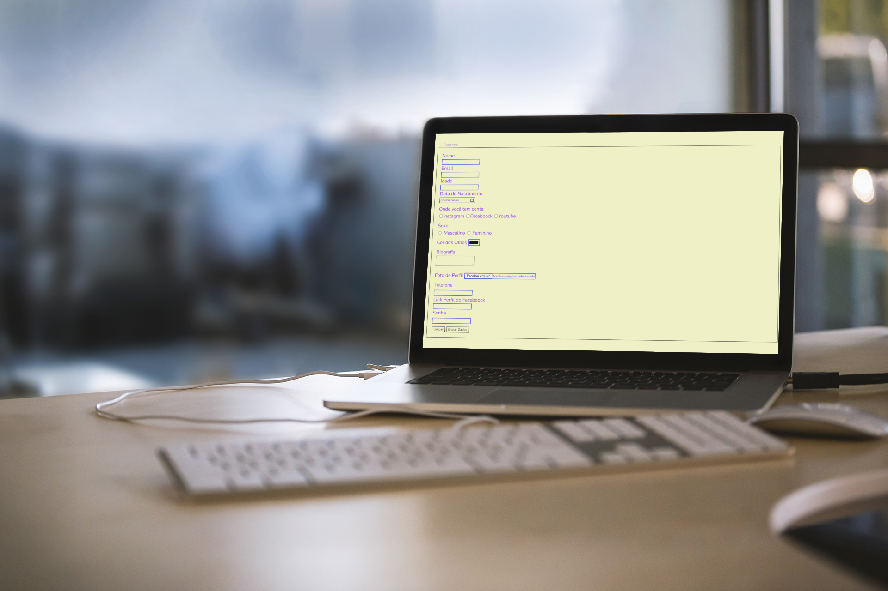

# Formulário

       

> Formulário.

### Meu primeiro formulário.

Exercício do formulário focou nas seguintes tarefas:

- [x] Criei uma borda no entorno do mesmo.
- [x] Ynputs escolhi uma cor que não fosse preto.
- [x] Cor do Background.
- [ ] Escolha da Fonte e tamanho.
- [ ] Botões com zoom e cores diferentes ao passar o mouse.

## 🚀 Tecnologias:

  

## 🤝 Colaborador

<table>
  <td>
    <td align="center">
      <a href="#">
         
        
          <b>Selma Dias</b>
        
      </a>
    </td>
    
        
   
 
</table>

[⬆ Voltar ao topo](#YOGA) 

